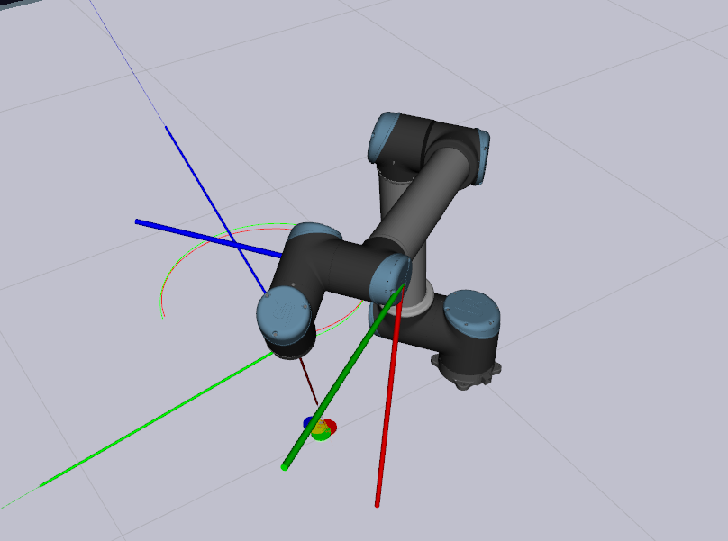
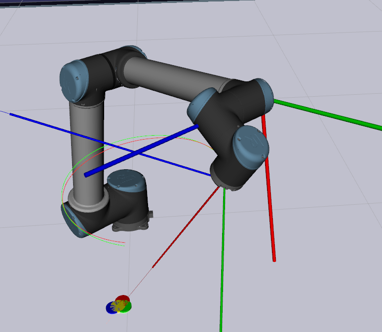
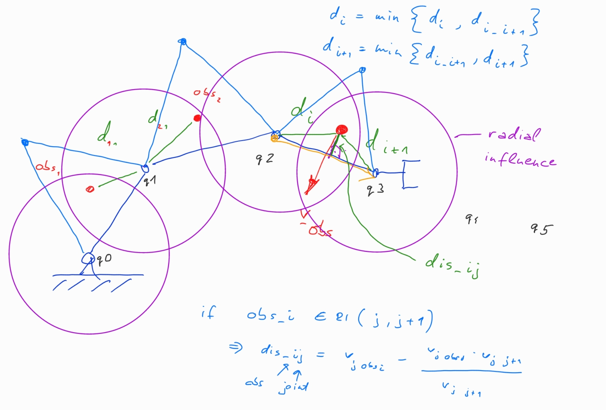

# MSRDM final project

Author: Daniel Tar

Supervisors: Dr. Emmanuel Dean, Simon Armleder, Maximilian Bader

Date: Munich, 18.03.2021

Picuters and videos are in the **res** folder.

----

## Prerequisites

<!-- * matlab & simulink with ros and areospace toolbox -->
* ROS melodic
* Libraries provided in the **util** folder

## Preparation steps

1. navigate to the project root directory
2. compile the project with ```catkin_make``` command
3. source the bash setup file with ```source devel/setup.bash``` command

Troubleshooting if the ```catkin_make``` command was not successfull:
Try running:
```
catkin_make --pkg object_msgs
```

## How to run the program

Run the following commands in separate terminals (do not forget to source the *setup.bash* file):

1. launch the simulator 

    ```roslaunch tum_ics_ur10_bringup bringUR10-simulator.launch gui:=true```

2. launch the controller 

    ``` roslaunch tum_ics_ur10_controller_tutorial testSimpleEffortCtrl.launch ```

* add moving targets

    ``` rosservice call /add_moving_targets ```

* add moving obstacles, where **#** is the number in [1, 3]

    ``` rosservice call /add_moving_obstacles "num: #" ```

Use the slider in the camera window to follow different objects.

# Task description

It is in the *final_project.pdf*.

# Used Approach

I have tackled the problem so, that I decomposed the 6DOF task in two 3DOF problem. The first 3DOF problem is the gazing and the last 3 joints are responsible for that and the second 3DOF problem is the End-Effector position trajectory tracking. For latter task the first 3 joints are responsible.

## Getting Targets and Obstacle Data

First I have subscribed to the respective topics and than I have transformed all the target (T_target_0) and obstacle (T_obs_0) positions received in the the robot base coordinate system.

## Finding the target pose

The target pose's position is always the position of the EF. I received the orientation with composing a direction vector from the EF position to the target position, and composing another vector from this one such way that the resulting target frame can be represented with ZYX Euler angle convention from the frame 3p (see later). With the trial and error approach at the end I found such a frame 3p and target frame representation where the euler angles do not have singularities.

## Gazing

I have noticed if I transform the T_3_0 frame with 90 [deg] then the last 3 joints are representing a ZYX Euler angle convention to the target frame (with an initial value shift). I used this property to lead back the gazing problem to a joint space tracking problem.

In my code I denote the transformed frame from T_3_0 with 90 [deg] as T_3p_0. For the gazing I needed the target frame (T_target_0) in the frame 3p, because I can get the euler angles ZYX from this relative transformation (T_target_3p).

T_3p_0 frame (thicker) | T_target_0 frame (thinner)    
:----------------:|:-------------------------:
 | 

For the gazing an adaptive PID Joint Space (JS) controller is used, what we have learned during the lecture.


## EF position tracking and Obstacle Avoidance

The position tracking is solved with an adaptive PID Operational (Cartesian) Space (CS) controller, as in the matlab tutorials.

But if an obstacle came close, then it is switched to an impedance control with repulsive forces from the obstacles and attractive force towards the desired EF position. The attractive force is maximzed, i.e. if the obstacles are really close to the robot, then it can move away from the desired position and avoid the obstacle. The resulting torque is the sum of the repulsives forces from the obstacles to all joints and the attractive torque to the desired EF position.

The impedance control is on until the EF current position converged back to an epsilon neighbourhood of the desired position. If it is achived than it switch back to the CS controller. 

Actually the whole tracking could be solved with an impedance controller, which results in a slightly bigger error, but it can also operate in the robot singularity positions.

The singularity avoidance mechanism is currently not implemented, it could be easily done by checking the manipulability index and switching to impedance control if it lower than a given threshold.

## Obstacle distance calculation

To not pass an obstacle through a link, I have implemented a specific distance calculation mechanism. The purple virtual spheres radius are a modifed link length with a factor in [0.5, 1.0]. If an obstacle is in the intersection of the spheres then the normal distance is also calculated from the obstacle to the given link. Minimum distance and it's direction is taken of the normal distance to the link next to the given joint and the general distance from the obstacle to the joint.



## Anti-Windup in the controllers

If the controllers reache the maximal torques, then the intergrator part is switched of not cummulate the error in this case, because it would lead to big torques from the controller's intergral part.

# Observations

* I have observed that if the robot model parameter learning is switched of after the JS control (STATE: moving out singularity), then the model compensation performs better.

* The decoupled control problem and the big differential gains are leading to oscilations in the EF position if the desired gazing orientation heavily changed, i.e. swithing between targets.

* Euler angle singularites (e.g.: pitch = +-90[deg]):

    Because of singularities of the euler angles the robot is not able to gaze in every configuration, an example is provided in the config files, in which it is stop working.

    This error could be avoided with a different orientation representation like quaternions, but it would make the controller more complicated.

-----

## Future work

I really liked that this cool simulation environment was provided for us, that is why I would like to work further on  the project and try out different controllers. Maybe also try a 6DOF control.